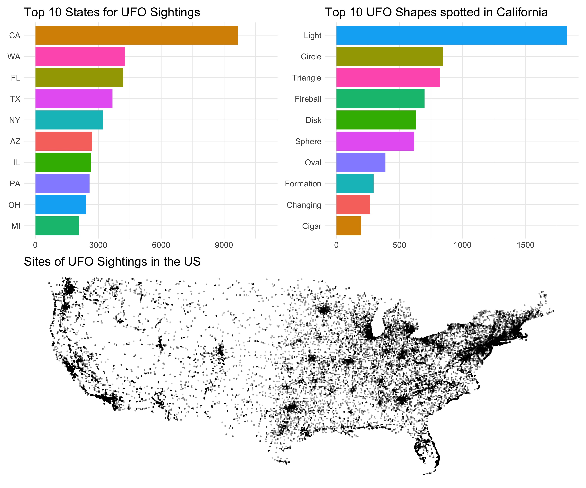

```{r setup, include=FALSE}
knitr::opts_chunk$set(echo = TRUE)
```

# Why R?

In this workshop I will introduce you to the language, [R](https://www.r-project.org/about.html), and [RStudio Desktop](https://rstudio.com), the integrated development environment (IDE) that you will use to write reproducible code involving the wrangling, visualization, summary, and statistical modelling of your data. Both R and RStudio Desktop are examples of [Open Source Software](https://opensource.com/resources/what-open-source). Open Source is key to producing reproducible research as Open Source software is free and available to all.

In the video below, I'll introduce you to R and talk about the importance of adopting such tools in our research analysis workflows.

&nbsp;&nbsp;

<center>

<iframe width="560" height="315" src="https://youtube.com/embed/GKJmY_YebhU" data-external="1" frameborder="0" allowfullscreen></iframe>

</center>

&nbsp;&nbsp;

<center>

[{width=75%}](https://docs.google.com/presentation/d/1CkatVluJFu_XoBo1iA0xfACc-V9v-_-DqV3KIPZHgMU/edit?usp=sharing)

</center>

&nbsp;&nbsp;

Below is a video of a great talk by J.J. Allaire, entrepreneur and founder of RStudio (and other organizations). This video is from rstudio::conf 2020 and in it J.J. talks about his journey from being a Political Scientist, how he got involved in R, and the importance of Open Source in the context of Reproducible Data Science. If you click on the image, you'll be taken to the RStudio website where you can watch the recording. If you're interested, you might like to look at some of the other videos on the RStudio site.  

&nbsp;&nbsp;

[](https://rstudio.com/resources/rstudioconf-2020/open-source-software-for-data-science/)

&nbsp;&nbsp;

# Getting Started

In this next video I will show you how to install R (the language) and RStudio Desktop (the IDE for working with the language). You can download R from [here](https://www.stats.bris.ac.uk/R/) for a variety of platforms including Mac OS, Windows, and Ubuntu. To download free RStudio Desktop just go to [here](https://rstudio.com/products/rstudio/download/). 

If you are using a Chromebook, or have a tablet, or are having difficulties installing R and RStudio Desktop on your computer, you can use [RStudio Cloud](https://rstudio.cloud/) to run the RStudio environment in your browser. You'll need to sign up - there is a free plan available which allows you to use the RStudio Cloud for 15 hours per month. 

&nbsp;&nbsp;

<center>

<iframe width="560" height="315" src="https://youtube.com/embed//nsu2WQIeP5I" data-external="1" frameborder="0" allowfullscreen></iframe>

</center>

&nbsp;&nbsp;

<center>

[{width=75%}](https://docs.google.com/presentation/d/19Y70sxKZH0Wp1Lm-0FMktiHjfAHBvHJHSfdxpPQuIgA/edit?usp=sharing)

</center>

&nbsp;&nbsp;

# Customising RStudio

You can customise the look of the RStudio IDE to make it work best for you. In this video I show you some of the possible customisations you can use.

&nbsp;&nbsp;

<center>

<iframe width="560" height="315" src="https://youtube.com/embed/fwonkj-hZYc" data-external="1" frameborder="0" allowfullscreen></iframe>

</center>

&nbsp;&nbsp;

# Keeping Things Organised

When you are doing data analysis using R, it's important to use a sensible structure for your folders and files. As you saw in the video above, creating a new project with a .Rproj file is the easiest way to this is using RStudio Desktop. Good file management is as important as good coding style (which we'll come to next). There's a great paper on project management that you can read by clicking the image below.

&nbsp;&nbsp;

[](https://journals.plos.org/ploscompbiol/article/file?id=10.1371/journal.pcbi.1005510&type=printable
)

&nbsp;&nbsp;

<center>

<iframe width="560" height="315" src="https://youtube.com/embed/JslVB6Vfn0Q" data-external="1" frameborder="0" allowfullscreen></iframe>

</center>

&nbsp;&nbsp;

# Good Coding Style

In the following video I'll talk a little about good coding style. It's important when you're writing analysis scripts that your code is understandable by others, and by future you. If you get into the habit of good coding style early on, it will make things a lot easier in the long run - and you'll find it easier to work collaboratively as others will find it easier to work with you. 

&nbsp;&nbsp;

<center>

<iframe width="560" height="315" src="https://youtube.com/embed/U6LuufvDO_c" data-external="1" frameborder="0" allowfullscreen></iframe>

</center>

&nbsp;&nbsp;

You can have a look at the helpful Tidyverse Style Guide [here](https://style.tidyverse.org).

If you want to make your code and data open (and you really should unless there's a good reason not to do so), it's important to license it properly to allow others to (re)use and remix it. For my own work, I tend to use the most permissive license that I can. My 'go to' licenses are the [MIT License](https://opensource.org/licenses/MIT), and the [Creative Commons License CC-BY 4.0.](https://creativecommons.org/licenses/by/4.0/)

You can use [this handy guide](https://choosealicense.com) if you need help choosing the right license for your own work.

&nbsp;&nbsp;

<center>

[{width=75%}](https://docs.google.com/presentation/d/1ZNnQwgHx0EuWcmfC2ZovSZjoaPP3eUOvdOFF_98H1oI/edit?usp=sharing)

</center>

&nbsp;&nbsp;

# Your First R Script

You're now going to run your first R script. We will create three visualisations of UFO sightings in the US using a database of more than 80,000 UFO sightings over the years. Before you run the code, you will need to install three packages onto your computer - they are `tidyverse` and `patchwork`. 

&nbsp;&nbsp;

<center>

<iframe width="560" height="315" src="https://youtube.com/embed/ABgJfJYmWOs" data-external="1" frameborder="0" allowfullscreen></iframe>

</center>
&nbsp;&nbsp;

Once you have installed the packages, type the following code into a new R script. Run the code in the same way I show you in the video. Does your visualisation look like the one I generated?

```{r, eval=FALSE}
library(tidyverse) # load the tidyverse
library(patchwork) # needed to combine our 4 plots at the end

# read in data 
ufo_sightings <- read_csv("https://raw.githubusercontent.com/rfordatascience/tidytuesday/master/data/2019/2019-06-25/ufo_sightings.csv")

# plot of top 10 US states with number of sightings in each state
plot1 <- ufo_sightings %>%
  filter(!is.na(state)) %>%
  mutate(state = str_to_upper(state)) %>%
  group_by(state) %>%
  tally() %>%
  top_n(10) %>%
  ggplot(aes(x = reorder(state, n), y = n, fill = state)) +
  geom_col() + 
  coord_flip() +
  guides(fill = "none") + 
  labs(title = "Top 10 States for UFO Sightings",
       x = NULL, 
       y = NULL) +
  ylim(0, 11000) +
  theme_minimal() +
  theme(text = element_text(size = 15))

# work out states within lat and long limits (i.e., exclude Alaska)
tidied_ufo <- ufo_sightings %>%
  filter(country == "us") %>%
  filter(latitude > 24 & latitude < 50)

# plot all sightings on a map of the US
plot2 <- tidied_ufo %>%
  ggplot(aes(x = longitude, y = latitude)) + 
  geom_point(size = .5, alpha = .25) +
  theme_void() +
  coord_cartesian() +
  labs(title = "Sites of UFO Sightings in the US") +
  theme(text = element_text(size = 15))

# plot of top 10 UFO shapes spotted in California
plot3 <- tidied_ufo %>%
  filter(state == "ca") %>%
  filter(ufo_shape != "other") %>%
  filter(ufo_shape != "unknown") %>%
  group_by(ufo_shape) %>%
  tally() %>%
  top_n(10) %>%
  mutate(ufo_shape = str_to_title(ufo_shape)) %>%
  ggplot(aes(x = reorder(ufo_shape, n), y = n, fill = ufo_shape)) +
  geom_col() + 
  coord_flip() +
  guides(fill = "none") + 
  labs(title = "Top 10 UFO Shapes spotted in California",
       x = NULL, 
       y = NULL) +
  theme_minimal() +
  theme(text = element_text(size = 15))

# Put plots together
my_plot <- (plot1 + plot3) / (plot2)

ggsave("ufo_plot.jpg", plot = my_plot, width = 12, height = 10)
```

<center>

[]{width=100%}

</center>

## Improve this Workshop

If you spot any issues/errors in this workshop, you can raise an issue or create a pull request for [this repo](https://github.com/ajstewartlang/02_starting_with_r). 