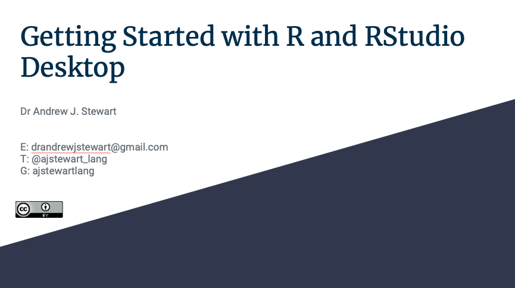

```{r setup, include=FALSE}
knitr::opts_chunk$set(echo = TRUE)
```

# Why R and RStudio Desktop?

In this workshop I will introduce you to the language, [R](https://www.r-project.org/about.html), and [RStudio Dekstop](https://rstudio.com), the integrated development environment (IDE) that you will use to write reproducible code involving the wrangling, visualization, summary, and statistical modelling of your data. Both R and RStudio Desktop are examples of [Open Source Software](https://opensource.com/resources/what-open-source). Open Source is key to producing reproducible research as Open Source software is free and available to all.

In the video below, I'll introduce you to R and RStudio Desktop and talk about the importance of adopting these tools in our research analysis workflows.

&nbsp;&nbsp;

[Link to YouTube talk here]

&nbsp;&nbsp;

If you have a Google account, you can also view and download the slides in a range of formats by clicking on the image below. If you don't have a Google account, you can download the slides in .pdf format by [clicking here](../slides/why_r_and_rstudio_desktop.pdf).

&nbsp;&nbsp;

<center>

[{width=75%}](https://docs.google.com/presentation/d/1CkatVluJFu_XoBo1iA0xfACc-V9v-_-DqV3KIPZHgMU/edit?usp=sharing)

</center>

&nbsp;&nbsp;

Below is a video of a great talk by J.J. Allaire, entrepreneur and founder of RStudio (and other organizations). This video is from rstudio::conf 2020 and in it J.J. talks about his journey from being a Political Scientist, how he got involved in R, and the importance of Open Source in the context of Reproducible Data Science. If you click on the image, you'll be taken to the RStudio website where you can watch the recording. If you're interested, you might like to look at some of the other videos on the RStudio site.  

&nbsp;&nbsp;

[](https://rstudio.com/resources/rstudioconf-2020/open-source-software-for-data-science/)

&nbsp;&nbsp;

# Getting Started

In this next video I will show you how to install R (the language) and RStudio Desktop (the IDE for working with the language). You can download R from [here](https://www.stats.bris.ac.uk/R/) for a variety of platforms including Mac OS, Windows, and Ubuntu. To download free RStudio Desktop just go to [here](https://rstudio.com/products/rstudio/download/). 

&nbsp;&nbsp;

[Link to YouTube talk here]

&nbsp;&nbsp;

You can also view and download the slides in a range of formats by clicking on the image below. If you don't have a Google account, you can download the slides in .pdf format by [clicking here](../slides/getting_started.pdf).

&nbsp;&nbsp;

<center>

[{width=75%}](https://docs.google.com/presentation/d/19Y70sxKZH0Wp1Lm-0FMktiHjfAHBvHJHSfdxpPQuIgA/edit?usp=sharing
)

</center>

&nbsp;&nbsp;

# Good Project Management

When you are doing data analysis using R, it's important to use a sensible structure for your folders and files. As you saw in the video above, creating a new project with a .Rproj file is the easiest way to this is using RStudio Desktop. Good file management is as important as good coding style (which we'll come to next). There's a great paper on project management in data analysis by Greg Wilson, Jenny Bryan and others that you can read by clicking the image below.

&nbsp;&nbsp;

[](https://journals.plos.org/ploscompbiol/article/file?id=10.1371/journal.pcbi.1005510&type=printable
)

&nbsp;&nbsp;

# Good Coding Style

In the following video I'll talk a little about good coding style. It's important when you're writing analysis scripts that your code is understandable by others, and by future you. If you get into the habit of good coding style early on, it will make things a lot easier in the long run - and you'll find it easier to work collaboratively (and others will find it easier to work with you). 

&nbsp;&nbsp;

[Link to YouTube talk here]

&nbsp;&nbsp;

You can have a look at the helpful Tidyverse Style Guide [here](https://style.tidyverse.org).

If you want to make your code and data open (and you really should unless there's a good reason not to do so), it's important to license it properly to allow others to (re)use and remix it. For my own work, I tend to use the most permissive license that I can. My 'go to' licenses are the [MIT License](https://opensource.org/licenses/MIT), and the [Creative Commons License CC-BY 4.0.](https://creativecommons.org/licenses/by/4.0/)

You can use [this handy guide](https://choosealicense.com) if you need help choosing the right license for your own work.

You can also view and download the slides in a range of formats by clicking on the image below. If you don't have a Google account, you can download the slides in .pdf format by [clicking here](../slides/good_coding_style.pdf).

&nbsp;&nbsp;

<center>

[{width=75%}](https://docs.google.com/presentation/d/1ZNnQwgHx0EuWcmfC2ZovSZjoaPP3eUOvdOFF_98H1oI/edit?usp=sharing)

</center>

&nbsp;&nbsp;

# Reading in Data

One of the tasks that R learners tend to find the hardest is loading their data. In this video, I show you the two main ways we will be using in this unit to load our data. All the data we will be working with is in *rectangular* format - in other words, data with rows and columns, and with one observation per cell. I will show you how to load data that's sitting on your own machine, and how to load data that's sitting on a webpage.

&nbsp;&nbsp;

[Link to YouTube talk here]

&nbsp;&nbsp;

You can also view and download the slides in a range of formats by clicking on the image below. If you don't have a Google account, you can download the slides in .pdf format by [clicking here](../slides/reading_in_data.pdf).

&nbsp;&nbsp;

<center>

[{width=75%}](https://docs.google.com/presentation/d/1g59NKvZ6JSszo1Z0pYOxKRgN44p-miepZ72Tooq8EnM/edit?usp=sharing)

</center>
